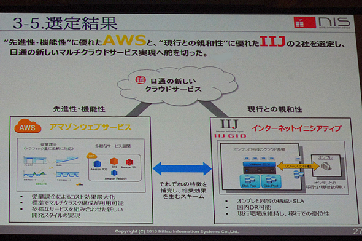

## 第四回　Next　Step Communications 説明会
   

### ・クラウドビジネスに参加している人々から見たクラウド
　(技術よりも人々の意見からの視点)
   

### ・とっても簡単なディープラーニングの例
　(人工知能は2015年現在まだできていないらしい)
   

### ・WeRTCアップデート  
　（WeRTCと既存コンタクトセンターとの共存への道)
---
## クラウド サーバー

* [さらば、インターネット
クラウドが急膨張、LANも「雲の中」に](http://itpro.nikkeibp.co.jp/atclact/active/15/062500071/070100001/?act12)  

---

## クラウド クライアント

* [Microsoft、スマートフォン部門で1850人削減　「撤退はしない」](http://www.itmedia.co.jp/news/articles/1605/26/news060.html)  ]
* [IBM Mac for business  (Mac@Workプログラム)](https://www.youtube.com/watch?v=Np4-Ivtd38U)  
* [IBM MobileFirst for iOS(サービス)](http://www.ibm.com/mobilefirst/jp/ja/mobilefirst-for-ios/)  

---

 
---
## オピニオン
* [ゼロ・トゥ・ワン―君はゼロから何を生み出せるか(ピーター・ティール)](http://www.amazon.co.jp/ゼロ・トゥ・ワン―君はゼロから何を生み出せるか-ピーター・ティール/dp/4140816589)  

  * 1998年にアメリカで起業したPayPalは、2002年、eBayによる買収によって多くの人材が流出。その結果、PayPal出身者による企業やサーヴィスであるYouTube、Linkedin、テスラ・モーターズ、Yelp!などが次々と誕生した。  
  【ペイパル人脈】  
    

---
* [<未来>のつくり方 －シリコンバレーの航海する精神](http://www.amazon.co.jp/〈未来〉のつくり方-シリコンバレーの航海する精神-講談社現代新書-池田-純一/dp/4062883155)
  * シリコンバレーで今、何が起きているか?  Google、Amazon、Facebookが目指すものとは?
  * 技術的特異点（Technological Singularity）とは人工知能が人間の能力を超えることで起こる出来事
  * [2045年問題 コンピューター・人工知能が人類を越えるとき](http://eco-notes.com/?p=794)  

* [権力の終焉](http://www.amazon.co.jp/権力の終焉-モイセス・ナイム/dp/4822250989)  
  * マーク・ザッカーバーグ（Facebook CEO）主催のブッククラブ第1回の課題書に選定されるや、全米で20万部超のベストセラーとなった話題  *作権力の衰退が世界を変えた！(ソーシャルメディアの台頭)

* [世界の経営学者はいま何を考えているのか](http://www.amazon.co.jp/世界の経営学者はいま何を考えているのか――知られざるビジネスの知のフロンティア-入山-章栄/dp/4862761097)
  * 組織の記憶力を高めるトランザクティブ・メモリー
  * メンバーが「What」よりも、「Who knows what」を記憶・共有している状態に重きを置く考え方 　
  * [グーグルが突きとめた！社員の「生産性」を高める唯一の方法はこうだ
プロジェクト・アリストテレスの全貌](http://gendai.ismedia.jp/articles/-/48137)  

* [ビッグデータの正体](http://www.amazon.co.jp/ビッグデータの正体-情報の産業革命が世界のすべてを変える-ビクター・マイヤー-ショーンベルガー/dp/4062180618)
      * データはデータに語らせろ(因果関係想定しない)  
      * 相関関係から有益な知見を見つけ出す  

* [WebRTC 成功事例 - 「投資」の中国、「仕事」の日本 ～中国の配車アプリに見る「中国経営」を考える](https://www.blwisdom.com/strategy/series/china/item/10486/10486.html?limitstart=0)  
  * [WeChat 500億円の投資「滴滴出行(Uberのライバウル)」で4兆円を得る](https://www.blwisdom.com/strategy/series/china/item/10486-78/10486-78.html?catid=n1605&start=1)　　
  * [アップル、中国配車アプリ「滴滴出行」に１１００億円出資](http://www.cnn.co.jp/tech/35082648.html?tag=cbox;tech)  

---
* [Cloud Computing wiki](https://en.wikipedia.org/wiki/Cloud_computing)  

  

---
* Cloud-computing layers accessible within a stack  

  * Infrastructure as a service (IaaS)  
  * Platform as a service (PaaS)  
  * Software as a service (SaaS)  
  * [Desktop as a Service (DaaS)](https://ja.wikipedia.org/wiki/デスクトップ仮想化)  

---
* [IaaS vs. PaaS vs. SaaS](https://www.youtube.com/watch?v=KgL3BfAc9Cs)  
  

* [「○○aaS」がどれだけあるのか調べてみました。](http://techblog.clara.jp/2014/12/as-a-service/)

---
## クラウド提供企業

* [AWS クラウド製品](https://aws.amazon.com/jp/products/)  

* [Google Cloud Platform](https://cloud.google.com/?hl=ja)  

* [Microsoft Azure](https://azure.microsoft.com/ja-jp/)  

* [IBM Bluemix](http://www.ibm.com/cloud-computing/jp/ja/)  

* [日立のクラウド Hitachi Cloud](http://www.hitachi.co.jp/products/it/harmonious/cloud/index.html)  

* [NEC Cloud Solutions](http://jpn.nec.com/cloud/)  

* [クラウド・コンピューティング : 富士通](http://jp.fujitsu.com/solutions/cloud/)  

* [NTTT コム パブリッククラウドサービス (Cloudn)](http://www.ntt.com/cloudn/)  

* [KDD クラウド](http://www.kddi.com/business/cloud/)  

* [IIJ GI- O 企業向けのインフラリソース (IaaS)](http://www.iij.ad.jp/GIO/)  

* [Nifty Cloud](http://cloud.nifty.com/)  

* [BIGLOBEクラウドホスティング](http://business.biglobe.ne.jp/hosting/) (日本で人気のクラウドサービス　奉行シリーズ）

* [さくらのクラウド](http://cloud.sakura.ad.jp/)  

* [IDC Frontier (IaaS) - Yahoo! JAPANグループ ](http://www.idcf.jp/)  

* [主要パブリッククラウドのサービス比較表を作ってみた(AWS,GCP,Azure)](http://qiita.com/yuiashikaga/items/99f295b80956b5b0d3ae)  

---
 * [AWSが圧倒、MSやグーグル健闘--ガートナーによるIaaS市場の各社評価](http://japan.zdnet.com/article/35065293/2/)  
* [AWS一強時代でも強さを発揮するマイクロソフト--そのクラウド戦略とは](https://japan.techrepublic.com/article/35072407.htm)  
Amazonがクラウド界の支配者であることは、なんら意外でない。Amazon Web Services（AWS）の規模は2位から5位の競合クラウドベンダーを束にしたよりも大きく、クラウド事業の売上高は73億ドルあり、成長率は81％と強烈だ。そしてGartnerによると、AWSの利用されている容量は、2位から15位のライバルを合計した10倍あるという。  

    
  Magic Quadrant for Cloud Infrastructure as a Service, Worldwode  

* [Microsoft – the only vendor named a leader in Gartner Magic Quadrants for IaaS, Application PaaS, and Cloud Storage](https://azure.microsoft.com/en-us/blog/microsoft-the-only-vendor-named-a-leader-in-gartner-magic-quadrants-for-iaas-application-paas-cloud-storage-and-hybrid/)  
    
  Magic Quadrant for Cloud Infrastructure as a Service, Worldwide  
---

## クラウド IoT 製品
* IPA IoTの全体像  

---
* キャノンの製品例  
  * [Common Platform Technologies - Canon](http://www.canon.com/technology/canon_tech/explanation/cp_tech.html)  

---
* IPA ヘルスケア機器とクラウドサービスの脅威と対策の検討例  

---
## クラウドの定義 (多面的な観点)

### NIST: National Institute of Standards and Technology (米国国立標準技術研究所)
* [The NIST Definition of Cloud Computing](http://nvlpubs.nist.gov/nistpubs/Legacy/SP/nistspecialpublication800-145.pdf) [[日本語訳]](https://www.ipa.go.jp/files/000025366.pdf)  
このクラウドモデルは 5 つの基本的な特徴と 3 つのサービスモデル、および 4 つの実装モデルによって構成される。  

*  基本的な特徴

  * オンデマンド・セルフサービス (On-demand self-service)  
ユーザは、各サービスの提供者と直接やりとりすることなく、必要に応
じ、自動的に 、サーバーの稼働時間やネットワークストレージのようなコ
ンピューティング能力を一方的に設定できる。  

  *  幅広いネットワークアクセス (Broad network access)  
コンピューティング能力は、ネットワークを通じて利用可能で、標準的な仕組みで接続可能であり、そのことにより、 様々なシンおよびシッククラ
イアントプラットフォーム（例えばモバイルフォン、タブレット、ラップトップコンピュータ、ワークステーション）からの利用を可能とする。  

  *  リソースの共用 (Resource pooling)  
サービスの提供者のコンピューティングリソースは集積され、複数のユ
ーザにマルチテナントモデルを利用して提供される。様々な物理的・仮
想的リソースは、ユーザの需要に応じて ダイナミックに割り当てられたり
再割り当てされたりする。物理的な所在場所に制約されないという考え
方で、ユーザは一般的に、提供されるリソースの正確な所在地を知った
りコントロールしたりできないが、場合によってはより抽象的なレベル
（例：国、州、データセンタ）で特定可能である。リソースの例としては、ストレージ、処理能力、メモリ、およびネットワーク帯域が挙げられる。

---
*  基本的な特徴 (続き)  

  *  スピーディな拡張性 (Rapid elasticity)  
コンピューティング能力は、 伸縮自在に、場合によっては自動で割当て
および提供が可能で、需要に応じて即座にスケールアウト／スケールイ
ンできる。ユーザにとっては、多くの場合、割当てのために利用可能な
能力は無尽蔵で、いつでもどんな量でも調達可能のように見える。  

  *  計測可能であること (Measured Service)  
クラウドシステムは、計測能力を利用して、サービスの種類（ストレー
ジ、処理能力、帯域、実利用中のユーザアカウント数）に適した管理レベルでリソースの利用をコントロールし最適化する。リソースの利用状況はモニタされ、コントロールされ、報告される。それにより、 サービスの利用結果がユーザにもサービス提供者にも明示できる。  

---
*  サービスモデル  

  *  ソフトウェア・アズ・ア・サービス（サービスの形で提供されるソフトウェア）SaaS(Software as a Service)  
利用者に提供される機能は、クラウドのインフラストラクチャ上で稼動している プロバイダ由来のアプリケーションである。アプリケーションには、クライアントの様々な装置から、ウェブブラウザのようなシンクライアント型インターフェイス（例えばウェブメール）、またはプログラムインターフェイスのいずれかを通じてアクセスする。ユーザは基盤にあるインフラストラクチャを、ネットワークであれ、サーバーであれ、オペレーティングシステムであれ、ストレージであれ、各アプリケーション機能ですら、管理したりコントロールしたりすることはない。ただし、ユーザに固有のアプリケーションの構成の
設定はその例外となろう。  

  *  プラットフォーム・アズ・ア・サービス（サービスの形で提供されるプラットフォー
ム） PaaS(Platform as a Service)  
利用者に提供される機能は、クラウドのインフラストラクチャ上にユーザが開発したまたは購入したアプリケーションを実装することであり、そのアプリケーションは プロバイダがサポートするプログラミング言語、ライブラリ、サービス、およびツールを用いて生み出されたものである。ユーザは基盤にあるインフラストラクチャを、ネットワークであれ、サーバーであれ、オペレーティングシステムであれ、ストレージであれ、管理したりコントロールしたりすることはない。一方ユーザは自分が実装したアプリケーションと、場
合によってはそのアプリケーションをホストする環境の設定についてコント
ロール権を持つ。  

  *  インフラストラクチャ・アズ・ア・サービス （サービスの形で提供されるインフラストラクチャ）IaaS(Infrastructure as aService)  
利用者に提供される機能は、演算機能、ストレージ、ネットワークその他の 基礎的コンピューティングリソースを配置することであり、そこで、ユーザはオペレーティングシステムやアプリケーションを含む任意のソフトウェアを実装し走らせることができる。ユーザは基盤にあるインフラストラクチャを管理したりコントロールしたりすることはないが、オペレーティングシステム、ストレージ、実装されたアプリケーションに対するコントロール権を持ち、場合によっては特定のネットワークコンポーネント機器（例えばホストフ
ァイアウォール）についての限定的なコントロール権を持つ。  

  *  計測可能であること (Measured Service)  
クラウドシステムは、計測能力を利用して、サービスの種類（ストレージ、処理能力、帯域、実利用中のユーザアカウント数）に適した管理レベルで リソースの利用をコントロールし最適化する。リソースの利用状況はモニタされ、コントロールされ、報告される。それにより、サービスの利用結果がユーザにもサービス提供者にも明示できる。  

---
*  実装モデル  

  *  プライベートクラウド (Private cloud)  
クラウドのインフラストラクチャは、複数の利用者（例：事業組織）から成る 単一の組織の専用使用のために提供される。その所有、管理、および運用は、その組織、第三者、もしくはそれらの組み合わせにより行われ、存在場所としてはその組織の施設内または外部となる。  

  *  パブリッククラウド (Public cloud)  
クラウドのインフラストラクチャは 広く一般の自由な利用に向けて提供される。その所有、管理、および運用は、企業組織、学術機関、または政府機関、もしくはそれらの組み合わせにより行われ、存在場所としてはそのクラウドプロバイダの施設内となる。

  *  ハイブリッドクラウド (Hybrid cloud)  
クラウドのインフラストラクチャは二つ以上の異なるクラウドインフラストラクチャ（プライベート、コミュニティまたはパブリック）の組み合わせである。 各クラウドは独立の存在であるが、標準化された、あるいは固有の技術で結合され、データとアプリケーションの移動可能性を実現している（例えばクラウド間のロードバランスのためのクラウドバースト）。  

  *  コミュニティクラウド (Community cloud)  
クラウドのインフラストラクチャは共通の関心事（例えば任務、セキュリティの必要、ポリシー、法令順守に関わる考慮事項）を持つ、複数の組織からなる成る 特定の利用者の共同体の専用使用のために提供される。その所有、管理、および運用は、共同体内の１つまたは複数の組織、第三者、もしくはそれらの組み合わせにより行われ、存在場所としてはその組織の施設内または外部となる。  

---
### Web-Scale IT (Gartner)
* [WebスケールITとのいう特異点](http://www.sbbit.jp/article/image/29832/l_bit201506092204575062.jpg)  

* テクノロジーを超えた総合的な取り組みとしての「WebスケールIT」6つの特徴  

  * 1点目は、「工業的なデザインのインフラストラクチャ」である。工業的とは、サービスの品質に着目し、余分な機能やコストを徹底的に削ぎ落とし、自動化し、これにより、変化への適応能力を高め、スケーラブルなデザインにするという考え方だ。   

  * 2点目は、「Web指向アーキテクチャ」であるということ。これは、障害は起きるという前提で構成されたアプリケーションのアーキテクチャのこと。たとえば、何万台、何十万台というハードウェアにより構成されたシステムでは、すべてのハードウェアが100％完全な状態で稼働しているわけではない。アプリケーションの連携も、あるアプリケーションが他のアプリケーションからの問い合わせに応答しないことがあっても、全体の稼働にはあまり影響がないような設計になっている。   

  * 3点目の特徴は「スピード重視のプロセス」だ。従来の企業ITでは、きちんとアプリケーションを作って、完成度を高めて、運用していくのが一般的であった。これに対し、WebスケールITでは、開発から稼働、運用、修正、機能強化をできるだけ短い期間で進めていく。   

  * 4点目の特徴は、「APIベースのツール群」だ。API化、すなわち、開発、テスト、運用の各フェーズにおいて、使われるツール類やコーディングのリソースや機能、あるいはITインフラそのもののすべてがプログラムで動き、変化に対して柔軟に対応している。   

  * 5点目は、「コラボレーションに根ざした組織」だ。「コラボレーション」とは、精神論でもなければ、ツールを導入して解決するものでもない。大事なのは目標を共有することで、共通のKPIを開発と運用で共有するといった定量的な仕掛け、仕組みが求められる。

  * 6点目の特徴は、「リスクを受け入れるカルチャー」だ。今まで想定していかったようなリスクや脅威がいつ、どこから出てくるかわからない。そうした状況に対応するためには、自ら破壊して、常に新しいことにチャレンジすることが重要だ。これまでにない考え方、型破りな発想が、WebスケールITの原資になっている。

---
### 「クラウド化」は緒に就いたばかり (日本)
* [幻滅期”のクラウド市場「クラウドが何か」の議論はもういい――可用性99.9％のシステムは実践あるのみ - ガートナー 亦賀忠明](http://techtarget.itmedia.co.jp/tt/news/1605/19/news05.html)  
* 「どんな技術も普及する過程で幻滅期はある。その技術がもたらす効能を冷静に見つめ、本物とニセモノを見極める上で健全なことだ。中長期的にはクラウドが普及していくのは間違いない。『クラウド化すべきか』という、10年も続く議論は早く終わらせ、次の議論に向かうべきだ」  

* ガートナーは、2つのモード（流儀）でITにアプローチする「バイモーダル」を提唱している。  
  * 既存システムをクラウドに移行し、従来通り堅く運用する「モード1」
  * クラウドを含む先端ITを駆使してビジネスをまわし、変化に柔軟に対応する「モード2」  

* クラウドの本質を持つサービスを選ぶ

* [日本におけるクラウドコンピューティングに関する採用状況](https://www.gartner.co.jp/press/html/pr20160421-01.html)  
2016年の日本におけるクラウドの採用率は16.1%、前年比0.3%増にとどまる =>(企業内基幹システム？）
  
---
* システムは可用性  
  * 梅はが99.9％（スリーナイン）  
  * 竹は99.99％（フォーナイン）  
  * 松は99.999％（ファイブナイン）  
  (*) AWSの「Amazon EC2」は99.95％の可用性を保証  

* クラウドベンダーのポジショニング  

---
## Amazon AWS
### AWS 使用例
オムニチャネル PDCAサイクル

---
* [Webと店舗が連動する新しい消費体験「POCKET PARCO」](http://classmethod.jp/cases/pocket-parco/)  

    

---
* [Muji Passport 分析処理系システム構成](http://www.sbbit.jp/article/cont1/32108)  

    
  [図](http://www.sbbit.jp/article/image/32108/l_bit201605111423374407.jpg)  
---
* [良品計画--AWSとAzureを使い分け](http://itpro.nikkeibp.co.jp/atcl/column/15/031600047/081800020/?ST=system&P=1)

  * データ分析のツールに応じて、Amazon Web Ser vices（AWS）とMicrosoft Azureを使い分ける  

  1. 非定型解析用ツール (AWS + Tableau)  
  2. 定型分析用ツール (MS Azure + Power BI)  

    

---
### AWS オープンソースの利用
* [Periscope/Twitter　動画のツイート](https://www.periscope.tv/)  
  * [Periscopeのライブ配信がついにTwitterフィードに登場](http://jp.techcrunch.com/2016/01/13/20160112periscope-streams-new-life-into-your-twitter-feed/)  
  * [Periscope and Twitter demo](https://twitter.com/)

    
  * [Twitter Flight 2015 - Up Periscope by Kayvon Beykpour and Sara Haider](https://www.youtube.com/watch?v=xjC3ZKYG74g)  

* [Twitterを使えなくなったMeerkatがWebからユーザをフォローできる機能を立ち上げ](http://jp.techcrunch.com/2015/03/19/20150318meerkat-now-lets-you-easily-follow-users-via-the-web/)  
---
* [Slack: Be less busy](https://slack.com/)  
  * We use Slack a lot and I think we like to say that it's really the rug that ties the room together.  

    
  * [Why April Underwood Joined Slack](http://fortune.com/2016/01/23/april-underwood-slack/)  
---
* [Slackが利用しているAWSサービス](https://aws.amazon.com/jp/solutions/case-studies/slack/)  

  * Elastic Compute Cloud (Amazon EC2)  
  * Simple Storage Service (Amazon S3)  
  * Elastic Load Balancing  
  * EC2 instances  
  * Virtual Private Cloud (Amazon VPC)  
  * Access Management (IAM)  
  * CloudTrail
  * Amazon Route 53

     
  * [An overvire of the Slack architecture on AWS]

---
* [Tableau Amazon Redshiftで構築するビッグデータ分析環境の構成要素と全体像](Amazon Redshiftで構築するビッグデータ分析環境の構成要素と全体像)  
     
   * アーキテクチャ構成図 「オンプレミス環境」+ Tableau
---
* [AWS QuickSight](https://aws.amazon.com/jp/quicksight/) (ビジネス・インテリジェンス)  
   非常に高速で簡単に利用できるクラウド対応のビジネスインテリジェンスを従来型BIソリューションの 1/10のコストで実現
     * [Introducing Amazon QuickSight](https://www.youtube.com/watch?v=Tj0gW4XI6vU)  
     AWS BI Apps  
       
     QuickSight Mobile    
     

---
* [Introducing AWS IoT](https://www.youtube.com/watch?v=N3-Az0OH5WM)  
 

* [AWS IoT プラットフォームの仕組み](https://aws.amazon.com/jp/iot/how-it-works/)  
   
[AWS IoT Platform図](https://d0.awsstatic.com/IoT/diagrams/awsiot-how-it-works_HowITWorks_1-26.png)  
---
* [Soracom次世代IoTアーキテクチャ](http://www.slideshare.net/SORACOM/itpro-expo-201520151002)  

 

 

---
* [AWS IoT ボタン](https://aws.amazon.com/jp/iot/button/)   
あらかじめクラウド内でコーディングした命令をボタンで押すことで実行する。Dashボタンと同様に特定の商品を発注したりできる他、車のロックを解除したり、家電製品のコントローラーとして使ったり、TwitterやFacebookと連係させることも可能だ。アイデア次第で可能性が広がる。

---
* [Architecture: Real Time Stream Processing - Internet of Things -Google](https://cloud.google.com/solutions/architecture/streamprocessing)  
    

---
* [Bluemix でのモノのインターネット](http://www.ibm.com/cloud-computing/bluemix/internet-of-things/jp-ja/)    

   

* [IBM Bluemix – From Idea to Application](https://developer.ibm.com/architecture/iot)  
---

* [IBM WebSphere and WebRTC – An Interview with Brian Pulito from IBM](https://thenewdialtone.com/ibm-websphere-webrtc/)    

---
### AWS Redshiftでビッグデータ分析

* [Amazon Redshiftで構築するビッグデータ分析環境の構成要素と全体像](https://codezine.jp/article/detail/7774?p=2)  
ゴールを決める
分析したいことを1つに絞って環境を整えよう
行いたい分析をイメージする
行いたい分析に必要な情報・項目を考える
分析に必要な情報や項目をカバーしているテーブル構成を考える
データが記述されたファイルをAmazon S3バケットへアップロードする
ファイルのデータをテーブルへ投入する前に、データを分析に適した形に整える手段を考える
データが記述されたファイルにETL処理を行う
データを一時テーブルに投入してSQLで加工する（SQLベースでのETL処理）

* [Amazon Redshiftの分析対象とするデータの設計／加工のポイント](https://codezine.jp/article/detail/7866)
  * [オンプレ側でファイル整形→S3にファイルをアップロード→Redshiftにデータを取込->解析ビュー](https://codezine.jp/static/images/article/7866/7866_redshift-dataflow-image-01.gif)  

* [Amazon Redshiftによるビッグデータ分析環境の構築手順](https://codezine.jp/article/detail/8003)  

* [Amazon Redshiftへのデータ投入からBIツールによる可視化までの手順](https://codezine.jp/article/detail/8438)  

---
## アスキー　クラウドクラブ
* [ASCII.jp 特集記事 飯田橋クラウドクラブ（略称：イイクラ）](http://ascii.jp/elem/000/001/097/1097061/)  
クラウド界隈の人たちをゲストに迎え、お酒を呑ませてフリートークを炸裂させようという連載企画「飯田橋クラウドクラブ（略称：イイクラ）」。クラウド業界のナウでヤングな話題が楽しく読めますよ。

* [DBもBIもセキュリティ監査も！AWSがもたらす破壊力を語るの巻](http://ascii.jp/elem/000/001/072/1072324/index-2.html)  

  * アスキー大谷：ストリーミングデータ解析のKinesisもファミリー化してきました。Kinesis Stream、Kinesis Firehose、Kinesis Analyticsなどなど。  

  * ウルシステムズ吉田（悦）：(Tableauと)せっかくここまでいい関係でビジネスやってきたのに、ここでQuickSightですかと思いますが……。   

  * アスキー大谷：ディスラプト（Disrupt：崩壊、粉砕）という点では、先ほど会場の立ち話でも話題になっていた「Amazon Inspector」ですね。脆弱性診断を自動化するということで、こちらもインパクト大きそうです。Amazon Inspectorの影響で失業者が出る？  

* [Aurora移行宣言ゲットのcloudpack吉田、re:Inventを総括するの巻](http://ascii.jp/elem/000/000/959/959402/)  

  * cloudpack吉田：はい。あのAuraアーキテクチャのいいところは、DBエンジンのよさもあるんだけど、クォーラムを実装しているので分散環境で安定して使えるところ。6本のディスクを搭載して、書き込みの応答が4本のディスク、読み出しの応答が3本のディスクを使う。要はディスクのライフサイクルに影響されることなく、性能が担保できてAvailabilityが99.99％で実現できる。ディスク障害時でも、読み書きの一貫性を保証できる。  
  * MB得上：（BIツールの）Tableauユーザーにとってみると、金額的にRedshiftはちょっと重たい。だから、Auroraに行くのかなあと。あと、私のようなデータ屋さんの目線からすると、やはりBigQuery対抗なんで。  
  * [(注) AWSが発表したOracle Databaseキラー、Amazon Auroraとは](http://www.atmarkit.co.jp/ait/articles/1411/14/news046.html)  

---
* [SIerのキーマンが本音で語った「クラウドは業界をどう変える？」](http://ascii.jp/elem/000/001/120/1120273/)  
  * TIS内藤：そうですよ（笑）。それはともかく、私ももともとはインフラエンジニアだったんですが、2009年くらいから自社のIaaSの立ち上げに携わっていたりします。2010年くらいに（当時のAWS エバンジェリストだった）玉川さんに出会って、AWSやばいなと思って、社内ではこっそりやってました（笑）。でも、おかげさまで今年はAWSのプレミアパートナーになり、けっこうな引き合いをいただいています。とはいえ、単純に再販だけでは儲らないので、IoTビジネスを企画していたりしています。  
  * SCSK浅野：はい。軋轢の方が面白そうなので（笑）。クラウドが出てきた時、弊社では「これからはハイブリッドクラウド」と言ってまして、自社のデータセンター＋パブリッククラウドじゃないとダメでしょという形で軋轢を産まないようにしていたわけです。なので、パブリッククラウド始めた時は、こっそり始めていました。  

  * スカイアーチ福島：私自体が3年くらい前にスカイアーチに移籍してきたんですが、そのときに無口な社長から「AWSで利益上げろ」と言われて、クラウドやり始めました。それまで私は自分でケーブル配線して、Linuxインストールするようなガチなインフラエンジニアだったんですが、いきなりクラウド使うことになったんです。でも、AWSにログインしたら、今までのオンプレの機器が要らないことがわかりました（笑）  

---
### Google Cloud
* [Google が抱く、クラウドへの大いなる野望とは？](https://agilecatcloud.com/2016/05/11/cloud-infrastructure-market-share-2015/)  
Googleはクラウド･ビジネスを強化するために、昨年(2015)だけで$10 billion(約1兆円)もの資本を投下した
  

* [Google App Engine(GAC)ドキュメント](https://cloud.google.com/appengine/docs?hl=ja)  
  * スケーラブルなウェブ アプリケーションやモバイルバックエンドを構築するためのプラットフォーム  
  * 使用できる言語はPython, Java, PHP, Go, Node.js, docker

* [Google BigQuery Documentation](https://cloud.google.com/bigquery/docs/)  
  * ビッグデータ解析サービス  
  * [誰でも簡単に超高速なクエリができるBigQueryとは？](http://www.buildinsider.net/web/bigquery/01)  

---
* [早すぎた本命「Google App Engine」に心を奪われた2人の巻](http://ascii.jp/elem/000/000/988/988900/index-2.html)  
吉積：僕、大手のSIerはクラウド向いていないんじゃないかなと思いますね。彼らとしては、ブラックボックスがいやなんですよ。あとは利用規約と責任範囲。少しでも顧客に不利益な規約、自分たちに責任負えない範囲があると、クラウドの構築や運用保守はいやがりますよね。

* [使いたければ使えば？ツンデレなGAEとBigQueryを語るの巻](http://ascii.jp/elem/000/000/988/988907/)  
上田：自分たち(Google)が欲しいから作ったので、要件合う人は使ってみればみたいにサービスを提供している感じ。

* [GCP上陸で風向きが変わる？Googleクラウド反撃ののろしの巻](http://ascii.jp/elem/000/000/990/990569/)  
上田：はい。去年、台湾にリージョンができて、専用線でつないでいるので、かなり速いんです。でも、AWSの東京リージョンと比べると、遅延は倍になってしまう。私が好きなGAEは、今もアジアにはないです。だから個人的にはGoogleは好きなんですが、発注する会社が公平に選択すると、やっぱりAWSなんです。

* [Google Cloud Platform](https://cloud.google.com/)  
  *[ソロソロ来るゾ！ Google Cloud Platform！](http://gihyo.jp/admin/serial/01/google-cloud-platform/0001)  

<strong>GCPとAWSのサービスラインナップ対比</strong>

<table border="1" rules="all">
<thead>
<tr class="header">
<th style="text-align: left;">サービス内容</th>
<th style="text-align: left;">Google</th>
<th style="text-align: left;">Amazon</th>
</tr>
</thead>
<tbody>
<tr class="odd">
<td style="text-align: left;">総称</td>
<td style="text-align: left;">Google Cloud Platform<wbr/>（GCP）</td>
<td style="text-align: left;">AWS</td>
</tr>
<tr class="even">
<td style="text-align: left;">コンピューティング</td>
<td style="text-align: left;">Google Compute Engine<wbr/>（GCE）</td>
<td style="text-align: left;">EC2</td>
</tr>
<tr class="odd">
<td style="text-align: left;">ブロックデバイスストレージ</td>
<td style="text-align: left;">GCEのPersistent Disk</td>
<td style="text-align: left;">EBS</td>
</tr>
<tr class="even">
<td style="text-align: left;">オブジェクトストレージ</td>
<td style="text-align: left;">Google Cloud Storage</td>
<td style="text-align: left;">S3</td>
</tr>
<tr class="odd">
<td style="text-align: left;">ファイアウォール</td>
<td style="text-align: left;">GCEのFirewall</td>
<td style="text-align: left;">Security Group</td>
</tr>
<tr class="even">
<td style="text-align: left;">ロードバランサ</td>
<td style="text-align: left;">GCEのLoad Balancing</td>
<td style="text-align: left;">ELB</td>
</tr>
<tr class="odd">
<td style="text-align: left;">RDBMS</td>
<td style="text-align: left;">Google Cloud SQL</td>
<td style="text-align: left;">RDS</td>
</tr>
<tr class="even">
<td style="text-align: left;">DNS</td>
<td style="text-align: left;">Google Cloud DNS</td>
<td style="text-align: left;">Route53</td>
</tr>
<tr class="odd">
<td style="text-align: left;">ビッグデータ</td>
<td style="text-align: left;">BigQuery</td>
<td style="text-align: left;">RedShift</td>
</tr>
<tr class="even">
<td style="text-align: left;">Container</td>
<td style="text-align: left;">Google Container Engine<wbr/>（GKE）</td>
<td style="text-align: left;">ECS</td>
</tr>
<tr class="odd">
<td style="text-align: left;">PaaS</td>
<td style="text-align: left;">Google App Engine<wbr/>（GAE）</td>
<td style="text-align: left;">Elastic Beanstalk</td>
</tr>
<tr class="even">
<td style="text-align: left;">KVS</td>
<td style="text-align: left;">Google Cloud Datastore</td>
<td style="text-align: left;">DynamoDB</td>
</tr>
</tbody>
</table>

---
### Microsoft Azure (Open Source系)

* [デプロイ王子、マイクロソフト入りの経緯を語るの巻](http://ascii.jp/elem/000/001/099/1099705/)  
  * ASCII大谷：確かにOSSへの取り組みを加速してきた感があります。
  * デプロイ王子：クラウドを俯瞰してみると、結局のところソフトウェアなんですよ。じゃあ、一番ソフトウェアを作っている会社ってどこか考えたら、どう割り引いてもマイクロソフトはその中に入ってくる。しかもHyper-Vのような仮想化環境を自ら持っている。ここでオープンソースをやるということで僕とマイクロソフトの価値観は一致したし、あまたのOSSがAzureで動かないかというとそんなことはないはずと思った。とはいえ、マイクロソフトという会社をMVPとして見ていて、いろんな内部的な矛盾が存在しているのも気がついてはいた。その中で、自分ができる仕事をなにか考えて、お役に立てるならやってみようと思って、腹を決めた感じです。     

* [第二次クラウド戦役に臨むマイクロソフトの意気込みを語るの巻](http://ascii.jp/elem/000/001/103/1103401/)  

  * 真壁：これはほかの方とちょっと見解が異なるかもしれないですが、AWS、マイクロソフト、Googleというメガクラウドベンダー3社の共通点は、最初にお客様のために作り始めたわけではないこと。自分たちがイノベーションに対して強い信念を持ち、それを実現するためにそれぞれの製品を作っているので、投資の仕方が全然違うんです。その他は、お客様のために作っているので、売れるかなという手探りが発生しています。ここに埋められない差ができています。

* [想像を超えたベンダーとの提携とAzureのデータ戦略を語るの巻](http://ascii.jp/elem/000/001/103/1103402/)
  * Azureで動いているOSの1/4はすでにLinux  
  * 得上：Azure Machine Learningが出だしたくらいから怪しいなと思っていたけど、CortanaとかAzure IoT Suiteとか、確かに自分が望むとおりに出てきた。  
  * デプロイ王子：バルマー前CEOも、きちんとナデラCEOのために花道を用意しておいたと思いますよ。今年はRoslynやVisual Studio CodeがOSS化されて、ライブラリでがんじがらめかと思いきや、ネイティブ実行できる。だから、C#とVisual Studio Codeで作ったプログラムをLinuxでも、Windowsでも、Macでも動かせる。自分でキャッシュも作れるし、サーバープログラム書き放題。ノンブロッキングやスレッドコントロールが.NETはしっかりしているので、面白いコードが書けると思う  

---
* [商習慣、リテラシ格差、文化……クラウドの未来はどうなる？の巻](http://ascii.jp/elem/000/001/103/1103403/)  

* デプロイ王子：クラウドはコストがわかりにくいという慢性的な問題がある。既存の商習慣といかにうまく合わせていくのかは、第二次クラウド戦役の大きな課題です。さっき出た営業さんがどうやって売るかわからないという課題もそこに起因しますよね。

* デプロイ王子：損益分岐点の考え方があきらかに違いますよね。

* 土居：年間で予算を考える会社と、今どきのスタートアップは会計の見方も違う。スタートアップは短期的にでも儲れば、お金をつっこむ。
* 真壁：僕は技術的な未来とビジネス的な未来を分けて考えなくてはいけないと最近考えています。日本のIT市場は約13兆円あって、その多くはエンタープライズやキャリア。まだまだクラウドは小さいので、エンタープライズやキャリアのところにどうやってリーチさせるか。これがビジネス的な未来。一方で古いモノを壊して、新しいモノを生み出すためのクラウド基盤という技術的な未来もある。このうちビジネス的な未来の方が、マイクロソフトの主戦場だと思っています。

* 得上：つまり、コンピューターからコンピュートに移ったわけですよ。これ2年間ずっと言いたかった（笑）。

* デプロイ王子：そういう意味では、今日の話って、やっぱり「2016年はPaaS元年」という結論になるのかな。AWSもLambdaを押しているし、Azureもプログラミングに最適なPaaSを展開している。

* 得上：Googleが最近発表したCPUとメモリがシームレスに可変するやつもその流れです。  

---
### IBM Bluemix

* [知られざる巨大クラウドSoftLayer/Bluemixの魅力を語るの巻](http://ascii.jp/elem/000/001/130/1130372/)

  * NI+C常田：クラウドが2階、データセンターが1階だとしたら、SoftLayerは1.5階くらいのサービス（笑）。たとえば、SoftLayerって全世界のL2ネットワークを単純にVLAN切っているだけなので、ログインするとすべてのリージョンのネットワークとサーバーが見えます。管理コンソール上でもリージョンという概念がない。  

  * ASCII大谷：AWS的な世界観からすると、リージョンの概念がないのはすごいですね。  

  * NI+C常田：1つのネットワークに、グローバルのデータセンターが見えます。管理上もフラットなので、とても変わってます。だから世界展開しているサービスだと、データセンターを増設したら、いきなりIPで疎通が確保できるので、楽ちんです。  

  * ASCII大谷：なるほど。AWSのように北米リージョンからサービススタートみたいな概念もないと。  

  * NI+C常田：はい。サービスもワールドワイドで開始されて、それで以上。バックアップとる時も、バックアップ先のサーバーをデータセンターで立ち上げれば終わり。AWSのようにVPCを作って、ルーティングさせるといった操作には基本的にはならないんです。ルーティングするとしても、既存のサブネットのルーティングと同じ。L2レベルのハートビートも普通に通りますし、マルチキャストも通ります。  

  * 最新技術のスピード感が魅力なBluemix  

  * CTC原田：一番の魅力はスピード感だと思っています。旬な技術がいち早く取り入れることができ、無償範囲も多いので、いろいろ試せます。新しい技術を組み合わせて、ハッカソンで新しいモノを作るのに向いているのがBluemixですね。なにしろ、最近はサーバーを作るのが面倒くさくて、AWSでもElastic Beanstalkとか使っちゃいますから。  

---
* [苦労はあるけど、新しいもの好きにはたまらないBluemixの巻](http://ascii.jp/elem/000/001/130/1130372/)  

  * NI+C常田：AWSはサービスが体系付けられていて、マニュアルとか、サービスの説明もうまい。一方、Bluemixは良いサービスがあるのに説明が下手で、イマイチなにがあるのかわからない（笑）。サービス本体も、補助的なサービスもデータベースもすべてがぐちゃぐちゃに混ざっているので、どれがどの機能を提供してくれるのか、さっぱりわからない状態。使ったら便利だろうなというサービスが放置されていて、「こんな便利なモノ、昨日提案しなかったな」みたいな（笑）。  

   * 日立横井：最初、Bluemix勉強会に参加した時、サービス140種類以上ありますと言われて、どれを使えばいいかわからなかったです。結局、6回くらい勉強会に参加して、徐々に自分の作りたいアプリケーションに使えるサービスを見つけました。  

  * NI+C常田：Bluemixは「Local」とか、「Dedicated」という提供形態があります。Localというのは自社のデータセンターにBluemixを導入する形態なんです。さらにDedicatedはSoftLayer上に実装したBluemix環境を貸してくれるというサービスなので、どちらの場合もマネジメントをIBMに任せられます  

---
* [次は連携？SoftLayerとBluemixユーザー会の存在意義を語るの巻](http://ascii.jp/elem/000/001/130/1130381/)  

  * CTC原田：数えてみたら、去年は230回やってました。Bluemixはサービスのラインナップが多くて、WatsonやIoT Foundation、DevOps、データベースなどなんでもあるので、エンジニアが混ざり合うので大変です。この中ではやっぱりWatsonとNode-REDが人気高いですね。  
  (注)[Integrating Node-RED, IoT and the Liberty Profile using WebRTC](https://www.youtube.com/watch?v=svap8p2XBBw)  
  (注)[目からウロコ！Node-REDのデザインパターン10選](http://qiita.com/zuhito/items/e9abfd6f1ba188f908ed)  

  * CTC原田：現状は、まずはどんなもんだか、探りに来ている感じですかね。全般的にはスーツ族が多いですが、開発者の集まりっぽくないので、スーツで来ないでくださいとお願いしました（笑）。  

  * 大平：PaaSなのにスーツが多い（笑）。私もJAWS-UGやJAZUGに比べても、スーツが多くてびっくりしました。でも、ユーザー的にこれからそっちの方向にしか増えないですしね。  

  * 日立横井：サポートって実際にはどんな感じなんでしょう？Bluemixの管理画面や問い合わせ先のページが日本語なので、先日、日本語で料金のことをメールで問い合わせたら、英語で書いてくれと返事がきましたが（笑）。  

  * CTC原田：今までPaaSって挫折ポイントがやたら多かった。IaaSと違って、ログや細かい設定など触れない領域があるのがまず不安。ステージングまで進んでも、いざ本番適用のときに、障害対応できるか不安になる。せっかくチャレンジしても、挫折して、PaaS嫌いになってしまう。  

  * NI+C常田：正直、今まで売れたPaaSってないんじゃないかな。先日はFacebookもParse.comの終了を発表したし。エンタープライズの企業だと、デプロイはオペレーターとか決まっていて、開発者はデプロイできないという組織もあります。そういうところにBluemixを売ろうとすると、どうなるかわからないという声が返ってきます。[Parseを閉鎖](http://jp.techcrunch.com/2016/01/29/20160128facebook-shutters-its-parse-developer-platform/)  

  * ASCII大谷：CTCさんのような大手SIerにとって、PaaSというのは新しいビジネスを起こす基盤にもなるんでしょうか？  

  * CTC原田：「クラウドでコスト削減」といったときに、削減されるのはSIerの食い扶持なんです。その点、Bluemixは攻めのITに向いているサービス。新しいサービスに向いているし、アジャイル開発にも適しています。だから、新しい開発文化を企業に根付かせて、スピード重視のビジネス部門に応えていける。クラウドであれば、サービスが拡大したら、スケールさせることが可能です。だから、うちのようなSIerでもPaaSに関しては前向きです。  

---
## AWS ユーザーの声
### TechTarget JAWS DAYS 2016レポート (パルコ、コーセー、クックパッド、media)

* [クックパッド、パルコなど先行4社が語る、「AWSで何が変わった？」](http://techtarget.itmedia.co.jp/tt/news/1604/06/news06.html)  

 * クラウドサービスの企業利用は当たり前になりつつある。とはいえ、オンプレミスでもメリットが得られる業務システムの世界では、まだ浸透し切っていないのが実態だ。  

* 自己紹介、AWSとの出合い
  * パルコ 林氏　パルコでは、店頭のデジタルサイネージのデータをAWSに置くといったように、積極的にクラウド化を進めています。店内に設置しているお客さま用無料Wi-Fiから顧客の館内移動ログを取得し、季節や天気、顧客動向の相関関係について分析しようとしています。好きなAWSのサービスは、データウェアハウス「Amazon Redshift」です。[デジタルサイネージ 電子看板](https://ja.wikipedia.org/wiki/デジタルサイネージ)  

  * コーセー 小椋氏　好きなサービスは仮想サーバの「Amazon EC2」と専用線接続の「AWS Direct Connect」。AWSとの出合いは、店頭のiPadをDirect Connectで接続したことでした。コーセーでは必要なシステムを全て社内開発しており、AWSは新システム検討時には必ず選択肢に入る重要な要素です。[AWS Direct Connect](https://aws.amazon.com/jp/directconnect/)  

  *  クックパッド 星氏　好きなサービスは、アクセス管理の「AWS IAM（Identity and Access Management）」、暗号化キー作成／管理の「KMS（Key Management Service）」、コード実効／管理の「AWS Lambda」など。クックパッドでは一部のシステムを除き、2011年8月にデータセンターからAWSへ完全移行しているため、入社時には既にクラウドありきの状態でした  

---
* AWSを導入した前と後で、どのような変化が起こりましたか。  

  * パルコ 林氏　最も大きな効果はWebサイトをピーク時に合わせて設計しなくて済むようになったことです。  
　* コーセー 小椋氏　もっとも、システム単体の改善よりも、それによって新しいことにチャレンジしやすくなったことの方が大きな効果だと考えています。まずAWSのサービスを立ち上げて試してみる姿勢が生まれ、仕事のスピード感が増してきました。  

  * クックパッド 星氏　会社としての新しいチャレンジ、機能開発がAWSならすぐに始められます。開発環境には「Ruby on Rails」を使い、思い付いたものはどんどん作り、不要なものはすぐに廃棄するという手法を取っています。  

  *  mediba 山田氏　開発が終わっても実際の環境へ移すという大変な作業がありました。AWSを使うようになってからは、本番環境への移行作業も楽になりました。  

* AWS導入で見えてきた、今後の展望について教えてください。  

  * mediba 山田氏　今後はオンプレミスとクラウドの分業体制にしていくつもりです。クラウド専業の部隊を作ることで、クラウドに特化した知見がたまっていくと期待しています。  

  * クックパッド 星氏　オンプレミスのシステムを完全になくせるわけではないですし、クラウドに移行してもインフラ管理者は相変わらず必要だと思います。各アプリケーションのシステムについては業務部門にオーナーシップを持ってもらいたいですが、その下のインフラレイヤーについてはIT部門のインフラ管理者が責任を持つべきだと考えています。  

  * コーセー 小椋氏　AWSを使うようになってから、開発スキーム自体に大きな変化が起きています。IT部門から持ち掛けるのではなく、ユーザー部門から直接アプリケーション開発の相談が来るようになりました。開発段階から一緒に取り組むことで、よりユーザー部門の意向に沿ったアプリケーションを作れるようになったと感じています。  

---
### EMC Forum 2015リポート (日通)

* [“ネガキャン”にも負けない　日通がプライベートからパブリッククラウドへ移行するまで](http://techtarget.itmedia.co.jp/tt/news/1511/17/news09.html)  
 * 近年、プライベートクラウドからパブリッククラウドへ移行する企業が出てきている。中でも日本通運はAWSとIIJのマルチ体制を取った点がユニークだ。移行プロセスも緻密に計画。注目プロジェクトを担当者が語った  

  * ITインフラの移行の流れはデータセンター、プライベートクラウド(VMware)を経てパブリッククラウド(AWS, IIJ)へ  

* プライベートクラウドの限界

  * 日通情報システムの下田 よしの氏は、個別最適化による課題(データセンター）を3点挙げた。「1つは高コスト体制であること。次に、システムの要件定義を経てインフラを調達するため構築期間が長期化すること。さらに、ベンダーロックインという一番大きな問題を抱えることとなった」と話す。そこで日通情報システムが取り組んだのが、サーバ仮想化によるITインフラ統合だった。[ベンダーロックイン](https://ja.wikipedia.org/wiki/ベンダーロックイン)  

  * プライベートクラウドで得られたメリットを2つ挙げた。1つは、インフラ調達の短期化だ。仮想化技術によって、仮想マシンの払い出しが簡単になり、マシン調達にかかる期間は3カ月から10営業日にまで短縮した。もう1つは、コスト削減だ。  

---
  * 　プライベートクラウドによって多数のメリットが得られた一方で課題も見えた。「仮想マシンが増えたことで運用工数が増加し、リソースプールの構築管理業務も負荷が増えた。また、専任の運用チームには、あらゆるアプリケーション担当者から連絡がくるため業務が集中することになった」と、運用管理における負荷増大を指摘した。こうしたハードウェアを含むインフラ課題を解決するため、次期インフラ選定を開始した  

* プライベートクラウド全体概要図  
  

---

  * 検証項目は、「コンプライアンス」と、プライベートクラウドと同じOSやミドルウェアが使えるかという「システム特性」、そして「サービスレベル」の3点で、「○△×」で評価した  

  zsパブリッククラウド選定結果  
  

* 日通情報システムが選んだクラウドベンダーは2社。1社は先進性、機能性に優れたAWS。もう1社は、現行のプライベートクラウドと親和性に優れたインターネットイニシアティブ（IIJ）だ。IIJは、オンプレミスで使用していたVMwareが使える点が評価のポイントとなった。

---

* サービスカタログとガイドラインを制定  

  * ここまで、選定に至るまでのプロセスをリポートしたが、これだけではサービス化はできない。日通情報システムがサービス化に向けて取り組んだこと。それは「サービスカタログ」の作成と「ガイドライン」の制定だ

  * 災害対策についての考え方やアプリケーション開発手法など、AWSとIIJは異なる考え方をしているため、整理してサービスカタログに記載した。カタログを整備した後、日本通運の情報システム部門はもちろん、アプリケーションベンダーなどの関係者総勢450人に対して、サービス説明会を6回実施したという。

* AWS、IIJそれぞれのメリット／デメリット

  * AWSとIIJに対してはどのような評価なのか。IIJを選んで良かったポイントについては高品質、高可用性を挙げた。「利用を開始して1年半たつが、メンテナンス以外で止まった記憶がない。また、日本企業ならではの手厚いサポートがある。サービス開始後、どうしてもサービスメニュにないサーバを用意してほしいと要求したところ、特別にサーバ調達をしてもらえた。AWSでは無理だったこと」と評価した。

  * 一方、AWSに関しては、「何と言っても業界のプライスリーダーであること。われわれがAWSのサービスを使い始めてから3回はインスタンスの値下げがあった。前回比60％値下げのインスタンスモデルもあった。また、新サービスが続々登場することも魅力。全部のサービスを使うわけではないが、最新のCPUを搭載したサーバモデルが定期的に登場し恩恵を受けている」と評価した。

  * パブリッククラウドで苦労した点は多い。例えば、「アプリケーションベンダーの中にはクラウドを利用することを快く思わず、いわゆる『都市伝説』を日本通運のアプリケーション担当者に吹聴することもあった。それによって『パブリッククラウドのサービスはOSに勝手にパッチが当たるため、納品されたアプリケーションが突然動かなくなることがある』といったようなうわさが広まった」。こうしたネガティブキャンペーンには、先に制定したサービスカタログやルールブックを示し正しい情報を啓蒙することで対処してきた。「サービス説明会後、半年ほどこうした炎上騒ぎは起きたが、今は沈静化している」と話す。

  * もう1点、つまずいたのはAWSのサポートサービスの選定だ。当初は中ランク程度のサポートを契約していたそうだが、1年ほどで限界がきたという。「何か起きた時にタイムリーに情報がほしいため、利用開始後1年を過ぎたころからはエンタープライズサポートに変更した」
  * 今後も残りのプライベートクラウドのシステムをパブリッククラウドへ移行していく予定だ。グローバルサービスの提供も視野に入れている。2019年度末までに、全システムのパブリッククラウド運用が目標だ。

### 人工知能

### 人工知能の出発点
* [人工知能は人間を超えるか ディープラーニングの先にあるもの - 東京大学準教授 松尾豊](http://www.amazon.co.jp/人工知能は人間を超えるか-ディープラーニングの先にあるもの-角川EPUB選書-松尾-豊/dp/4040800206)  

  * (現在出版されているAIの概説書(一般向け)としてこれ以上のものはないのでなはいか。)  
  * 人工知能をつくるときに、よくたとえられるのが、飛行機の例である。人間は昔から空を飛びたいと思っていた。鳥のまねをするような「はばたく」飛行機を何度もつくろうとしたが失敗した。そして始めて成功したライト兄弟の飛行機は、エンジンを積んだ「はばたかない」飛行機であった。つまり、生物をまねしたいと思っても、必ずしも生物と同じようにやる必要はないのだ。  

  * 飛行機の場合は、 鳥が飛ぶための「揚力」という概念をみつけ、揚力を得るための方法（エンジンでの推進力を得て、翼でそれを揚力に変える）を工学的に模索すればよかった。 人工知能においても、知能の原理を見つけ、それをコンピュータで実現すればよい。 それが人工知能という領域のそもそもの出発点である。

---
## 人工知能
* [Large Scale Visual Recognition Challenge (ILSVRC)](http://www.image-net.org/challenges/LSVRC/)  
* [物体認識競技会](http://lab.synergy-marketing.co.jp/blog/tech/object_recognition_competition)  

  コンペ(ILSVRC 2012 Task1)では、１０００万枚の画像データから機械学習で学習し、１５万枚の画像を使ってテストをして、正解率（エラー率の低さ）を測定する。
  [(ILSVRC 2012 Task1 Results)](http://image-net.org/challenges/LSVRC/2012/results.html)  

  機械学習といっても、特徴量の設計は、長年の知識と経験がものをいう職人技である。職人技により、機械学習のアルゴリズムと特徴量の設計が少しづつ進み、１年かけてようやく１％エラー率が下がるという世界だ。その年もエラー率２６％台の攻防のはずだった。（図を２０を見ると、１位、２位を独占したSuperVision(エラー率１５、１６％台)を除けば、エラー率２６％台いくつものチームが並んでいるがわかる）  

  ちなみに、事前言語処理でも検索でも、人工知能技術を用いて最後にコンマ何％という性能の勝負の段階になると、必ずこの職人技のかたまりになっている。研究者としてはあまりおもろくないところだ。実はSiriのような「音声対話システム」もワトソンのような「質問応答システム」もほとんどこの段階に入っていて、研究者からすると、「やってもいいけど大変なわりにあまり未来がない）ように思える世界である。その世界ですこしずつ性能を上げていくには、気の遠くなるような努力が要求される。  

  ところが、２０１２年に初参加したトロント大学は、ほかの人工知能を１０％以上に引き離して、いきなりエラー率が１５％台をたたき出した。これは長年、画像認識の研究を進めてきたほかの研究者も度肝を抜かれた。
勝因は同大学教授ジェフリー・ヒントンが中心になって開発した新しい機械学習の方法「ディープラーニング（深層学習）」だ。  

  ディープラーニングは、データをもとに、コンピュータが自ら特徴量を作り出す。人間が特徴量を設計するのではなく、コンピュータが自ら高次の特徴量を獲得し、それをもとに画像を分類できるようになる。  
ディープラーニングによって、これまで人間が介在しなければならなかった領域に、ついに人工知能が一歩踏み込んだ。  

---
* 日本全国の天気から地域をあぶりだす（ゲーム）  
  * ＜ルール＞  
２人１チームで戦う伝言ゲームです。チームの中で、１人にだけ、ある１日の日本全国４７都道府県の天気（晴れか曇りか雨か）が知らされます。これをもう１人のチームメンバーに伝え、その人が４７都道府県の天気のうち、何個を正確に答えられたかを競います。このとき、手紙そ渡してメッセージを伝えますが、日本全国のうち１０個所の天気だけを伝えることができます。その１０個所の天気をもとに、もう１人は４７個所の天気を予想します。  

* 特徴表現①　単純に北から順番に１０個所を選ぶ。  
（北海道、青森、岩手、宮城、秋田、山形、福島、茨城、栃木、群馬）  
（晴れ、晴れ、晴れ、晴れ、晴れ、晴れ、曇り、雨、曇り、曇り）  
=(2 ,2, 2, 2, 2, 2, 1, 0, 1, 1)  

* 特徴表現②　全国のある地点  
（北海道、岩手、新潟、東京、大阪、島根、高知、長崎、宮崎、沖縄）  

* 特徴表現③　全国、地域  
（全国、北海道、東北、関西、四国、九州、日本海側、太平洋側、沖縄）  
 (1.8, 1.0, 2.0, 1.5, 1.2, 0.8, 1.1, 0.3, 1.5, 0.0)  

* 香川県の天気  
全国 1.8 + 四国 0.8 / 2 = 1.3 四捨五入した結果 1 天気は「曇り」  

* コンピュータは、データ間の”相関関数”を分析することで、「特徴表現③」のようなものを”自動的に”に見つけることができる。  
つまり「東北」とか「関東」といった分け方は知らなくても、天気の関連が高いということから、地理的なまとまりを勝手に見つけることができるのである。そして、その中でも、最も適した特徴表現を自動的に見つけ出すことができる。

---
* 人工知能の日本の主な課題と対策  
  

---
### Machine Inteligence LANDSCAPE

* [The Current State of Machine Intelligence - Bloomberg, Dec 11, 2014](http://www.bloomberg.com/company/announcements/current-state-machine-intelligence/)  
 * [The Current State of Machine Intelligence -  Medium, Dec 11, 2014](https://medium.com/@shivon/the-current-state-of-machine-intelligence-f76c20db2fe1#.uh0rlcfys)  
  

  * [Machine Intelligence December figure](https://cdn-images-1.medium.com/max/1000/1*yGYPJRXWGubT6npH-LLvrA.png)

  * [Big Data Landscape](https://image.slidesharecdn.com/bigdatachartturckzilis-120629095525-phpapp01/95/a-chart-of-the-big-data-ecosystem-1-728.jpg?cb=1340963904)  

---

### AIの産業へのインパクト
* [The current state of machine intelligence 2.0 - Oreilly, Dec 10, 2015 ](https://www.oreilly.com/ideas/the-current-state-of-machine-intelligence-2-0)    
* [The Current State of Machine Intelligence 2.0 - Medium, Dec 16, 2015](https://medium.com/machine-intelligence-report/the-current-state-of-machine-intelligence-2-0-a9e0bab95511#.gxgfzizel)  

  
  [machine intelligence 2.0 figure](https://d3ansictanv2wj.cloudfront.net/mi-landscape-2.0-r9_update-f2048bd678f522066e294ba8233b6615.jpg)  

* [インダストリー4.0 (ドイツ)](https://ja.wikipedia.org/wiki/インダストリー4.0)  

---
## WebRTC Update
### Contact Center IVR with WebRTC (Robert Welbourn)

* [Avoiding Contact Center IVR Hell with WebRTC](https://webrtchacks.com/webrtc-contact-center/)  

  * Generic Contact Center Architecture

   

---
* [Avoiding Contact Center IVR Hell with WebRTC](https://webrtchacks.com/webrtc-contact-center/)  

  * Contact Center with WebRTC Gateways and Co-browse Server

   

---
### WebRTC Kranky Geek Events in India

* [Existing Call Center infrastructure to support WebRTC](https://www.youtube.com/watch?v=8Mr4dfZFavI)  

Step 1 WebRTC on Agent Side
  
---
Step 2 WebRTC on both Agent and Customer side
  

Step 3 Mobile WebRTC
  
---
Branchless Banking Use Case  
  
---
### Cafe X コンタクトセンターソリューション

* 組み込みアーキテクチャー　(楽天コミュニケーション)

  
---
* [CafeX Communications Customer Support](https://support.cafex.com/hc/en-us)  

  * [Understanding Fusion Media Broker Ports(Cafe X)](https://support.cafex.com/hc/en-us/articles/201378082-Understanding-Fusion-Media-Broker-Ports)  
  
  * [Fusion Media Broker Ports Figure](https://support.cafex.com/hc/en-us/article_attachments/200442061/FCSDK_MediaBroker_Ports.png)  
  * [Media Broker Cisco](https://jajp.help.webex.com/docs/DOC-7234)  
---
* 既存コールセンターへの接続構成例（CBA-Japan)  

  * [ブラウザだけで実現できる「顔の見える」おもてなしコールセンターー](https://cba-japan.com/cafex/wp-content/uploads/2015/03/01ab0a41e9b6a30185bf1330e5a72008.pdf)  
  

---
*  モバイルアプリ使用時（CBA-Japan)
  
---
